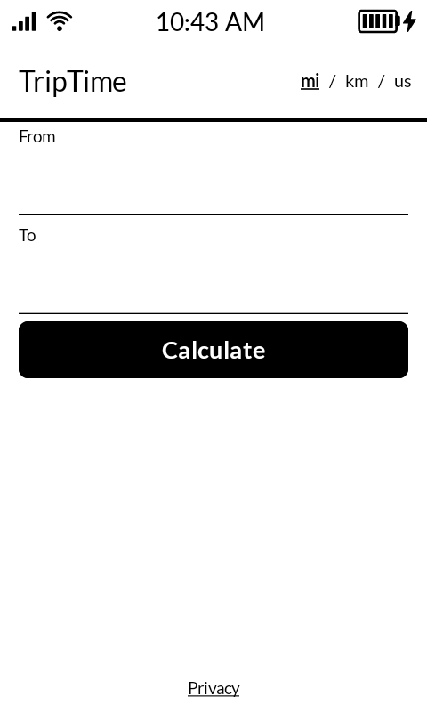
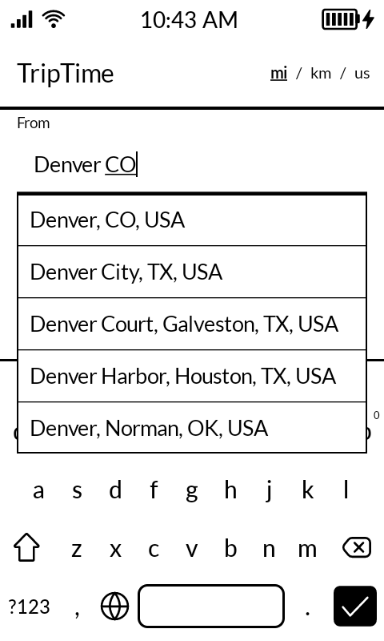
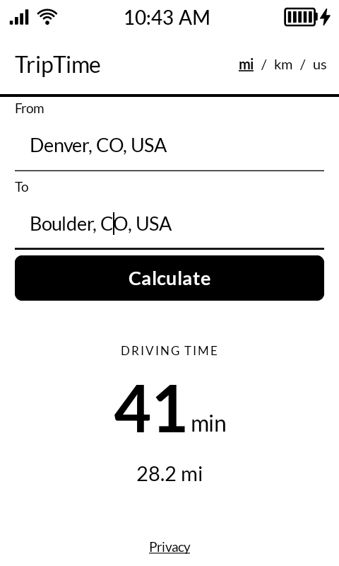
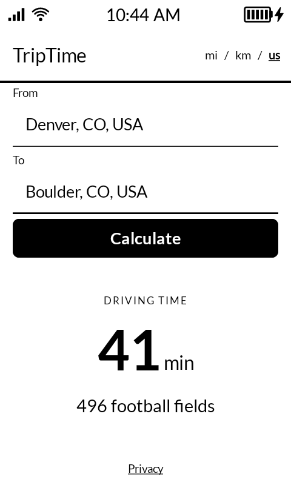
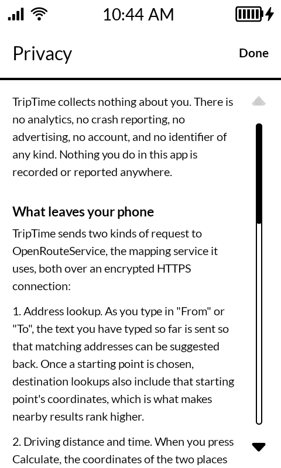

<p align="center">
  
</p>

# TripTime

A driving distance and estimated driving duration lookup for the [Mudita
Kompakt](https://mudita.com/products/phones/mudita-kompakt/) — Mudita's minimalist e-ink
phone. Type where you're starting and where you're going; TripTime tells you how long the drive
takes, with the distance underneath. That's it.

TripTime deliberately does **not** show a map, a route line, or turn-by-turn directions. If you
need those, this isn't the app — it's built around the Kompakt's e-ink screen and the idea that
a quick trip estimate shouldn't need a full navigation app...and that a full navigation app needn't
have this trip planning capability.

Does it seem ridiculous? Well it should, because this app is intended to be tongue-in-cheek. If the stock Maps app on the Kompakt had an adjustable "current location" on the directions feature, this app wouldn't be necessary. :-P

## Screenshots

Taken on a real Mudita Kompakt running MuditaOS K 1.5.0 — actual 480 x 800 panel output, not
renders or emulator captures.

<!-- A raw HTML table, not a Markdown one, purely so the columns can be pinned to 33% each.
     Markdown table columns size to their content, so the caption lengths were driving the
     column widths, and GitHub's `img { max-width: 100% }` then scaled each screenshot to
     whatever width its column happened to get — five identical 480x800 files rendering at five
     different sizes. Fixed widths make them match. The empty third cell in the second row keeps
     the column grid aligned; without it the two-image row stretches to half-width each. -->
<table>
  <tr>
    <td align="center" width="33%"><b>Start</b></td>
    <td align="center" width="33%"><b>Address autocomplete</b></td>
    <td align="center" width="33%"><b>The answer</b></td>
  </tr>
  <tr>
    <td align="center"></td>
    <td align="center"></td>
    <td align="center"></td>
  </tr>
  <tr>
    <td align="center">Two fields and one button. Nothing moves when the keyboard opens.</td>
    <td align="center">Suggestions for the destination rank near the starting point you already chose — no GPS involved.</td>
    <td align="center">Driving time is the headline; distance is the supporting fact.</td>
  </tr>
  <tr>
    <td align="center"><b>Novelty units</b></td>
    <td align="center"><b>Privacy</b></td>
    <td></td>
  </tr>
  <tr>
    <td align="center"></td>
    <td align="center"></td>
    <td></td>
  </tr>
  <tr>
    <td align="center">The <code>us</code> unit renders the distance in one of 30 objects of known length, picked at random per trip.</td>
    <td align="center">The Privacy page spells out exactly what does and doesn't leave your phone.</td>
    <td></td>
  </tr>
</table>

## Why no Google APIs?

The Kompakt runs MuditaOS K, a de-Googled build of AOSP with no Google Play Services. TripTime
gets addresses and driving directions from [OpenRouteService](https://openrouteservice.org/), a
free, open, non-Google routing API, over plain HTTPS. No Play Services dependency, no Google
Cloud billing account required.

## Setup

There isn't any. Install TripTime, type two addresses, press Calculate. There's no account, no
sign-in, and no key to paste — the released build carries its own OpenRouteService key.

**That key is shared.** Every install of a released TripTime APK uses the same community key,
which has a limited daily request quota. If that quota runs out, trips stop calculating for
everyone sharing that build until it resets — the in-app Privacy page explains this too. This
isn't a bug to report; it's the tradeoff of a build that needs no setup. If you're building it yourself from source, see
[Building from source](#building-from-source) — you'll use your own free key, with your own
quota, shared with no one.

TripTime asks for **no location permission**. It doesn't read the phone's GPS at all. Once
you've chosen a starting point, suggestions for the destination are ranked near *that* address,
which is usually what you want anyway. The in-app **Privacy** page spells out exactly what does
and doesn't leave your phone.

Distances show in `mi`, `km`, or `us` — the last being the distance in blue whales, Panama
Canals, or whatever else of known length happens to fit, on the grounds that an American will
measure anything in anything before using the metric system.

Requires Android 12 (API 31) or newer. The Kompakt itself supports sideloaded APKs through
Mudita Center; see Mudita's own [sideloading
guidance](https://support.mudita.com/en/support/solutions/articles/77000577356-does-mudita-kompakt-support-third-party-apps-)
— sideloaded apps aren't officially supported by Mudita and aren't guaranteed to behave
identically to the Kompakt's built-in apps.

## Design

Built with [Mudita Mindful Design](https://mudita.com/developers/) (MMD), Mudita's own
Compose component library for e-ink displays: pure black-and-white, no ripple or gradient
effects, no animated loading indicators, and immediate, deliberate interaction rather than
continuous scrolling — all in service of a screen technology that's slow to refresh and easy to
ghost if you fight it instead of designing for it.

## Building from source

```
git clone https://github.com/chadchad4423/TripTime.git
cd TripTime
./gradlew assembleDebug
```

A build made from a fresh clone has no API key and will say so instead of looking up trips. To
make it work, get a free key at <https://openrouteservice.org/dev/#/signup> (no credit card) and
add it to `local.properties`, which is gitignored:

```
ORS_API_KEY=your-key-here
```

**Never commit a real key.** Note also that the key is compiled into any APK you build and can
be extracted from it, so treat a build you hand to other people as a build that has given them
your key.

## Releases

Prebuilt, signed APKs are published on this repo's Releases page for anyone who'd rather
sideload than build from source. See "Setup" above for what that means: it carries a shared
community OpenRouteService key with a limited daily quota, not your own.

## Building a signed release

```
./gradlew assembleRelease
```

`assembleRelease` runs on any checkout, but it only produces an APK Android will actually
*install* on the one machine that holds the real signing keystore. Everywhere else it silently
produces an unsigned APK instead — that's deliberate, not a broken build; see the log line it
prints. To sign for real, add these to `local.properties` (gitignored, same as `ORS_API_KEY`
above):

```
RELEASE_STORE_FILE=/path/to/your-release-key.jks
RELEASE_STORE_PASSWORD=your-store-password
RELEASE_KEY_ALIAS=your-key-alias
RELEASE_KEY_PASSWORD=your-key-password
```

**Keep the keystore file itself out of any git working tree, gitignored or not, and back it
up somewhere durable.** Losing it doesn't just cost you a password — Android identifies an app
by who signed it, so a rebuilt keystore can never update an existing install; everyone who has
TripTime would need to uninstall and reinstall under a new signing identity.

## License

MIT — see [LICENSE](LICENSE).
